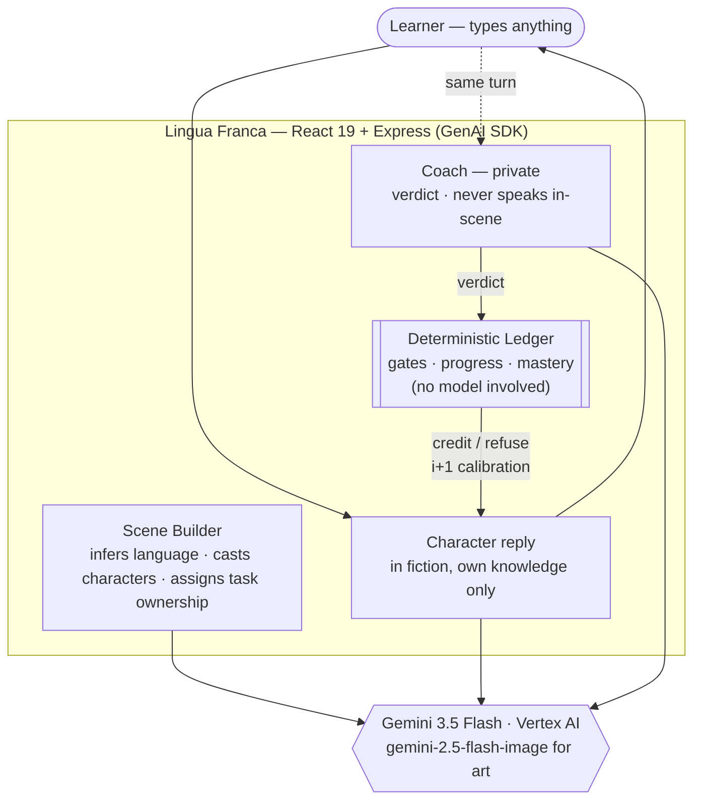

# Lingua Franca

**Learn a language by making yourself understood.**

Describe any situation in one sentence — *"a wine bar in Rome"*, *"an operating
theatre in Berlin"* — and Lingua Franca builds it: it infers the language from
the setting, casts characters who each know different things, writes the
objectives, and paints the world. Then you talk your way through it.

You pass by producing a sentence that **works**, not a perfect one.

> **Disclosure.** Lingua Franca was created during the All Things Agentic
> Hackathon submission period (August 2026). It runs on top of Roundtable, our
> pre-existing open-source agent runtime (Apache-2.0), which is used here as an
> underlying platform and extended with a new domain plugin and workspace
> blueprints written for this project. All Lingua Franca code in this repository
> is new work. Category: **Collaborative Partner**.

---

## The distinction

| Traditional language app | Lingua Franca |
|---|---|
| Produce the *expected* sentence | Accomplish the *communicative* goal |
| Grammar correctness is pass/fail | Adequacy is tiered: understood / repaired / failed |
| Corrections interrupt you | The world simply *reacts* to what you said |
| Fixed lessons | Any scene, any language, generated on demand |

`Quiero Toledo mañana nueve. Tarjeta.` is broken Spanish. The clerk understands
it and sells the ticket — then, once you've succeeded, shows you the natural
version. Communication comes before perfection.

## What it does

- **Scene builder.** One sentence becomes a playable world: language inferred
  from the setting, a cast with genuinely asymmetric knowledge, an objective
  broken into concrete tasks, and generated backdrop + character portraits.
- **Ask the right person.** In a multi-character scene every task belongs to one
  character. The concierge cannot give you the Wi-Fi password; reception can.
  Working out who holds what is part of the puzzle.
- **Five difficulty tiers** (A1→C1). They move two dials together: how many
  people are in the scene, and how strictly your language is graded — from
  "meaning alone" up to near-native accuracy and register.
- **Three outcomes per turn.** 🟢 understood · 🟡 repaired (you were
  misunderstood, then clarified — a real skill) · 🔴 not yet.
- **A private coach.** Never speaks in-scene. Scores every utterance, and at the
  end walks you back through the whole conversation with a natural-language
  upgrade for each line, then tells you what to study next — quoting what you
  actually wrote.

## Architecture

Two Gemini calls run concurrently per turn: the character's in-fiction reply and
the coach's private verdict. A deterministic ledger — plain code, no model —
owns every progression decision.

The server is **stateless**: the browser keeps the learner's ledger (an opaque
blob it never inspects, per language) and the facts communicated so far, and
sends both with each turn. Every adjudication — the gates below, ledger
updates, objective progress — still happens server-side in code each turn; the
client only stores the results. This is what lets the API run on Cloud Run
with scale-to-zero, and it also keeps each language's ledger separate.



### The deterministic floor

The model judges whether an utterance *worked*. **Code decides what counts.**
Three gates live in `playEngine.ts` and the ledger, not in prompts — so a
charitable model cannot inflate a learner past what they actually did:

| Gate | Rule |
|---|---|
| **Wrong language** | A message in English earns zero credit however clear its intent, and never touches vocabulary/grammar mastery. |
| **Task ownership** | A task is credited only if said to the character who owns it. Otherwise the response redirects you. |
| **Objective completion** | Progress is the union of tasks actually communicated, accumulated across turns. The scene ends when the ledger says so. |

Difficulty calibration (Krashen's *i+1*) is **computed, never narrated**: before
each turn the ledger reports what the learner reliably knows, what to stretch
toward, and what to keep out of generated speech.

### Roundtable platform integration

Beyond the app runtime, the same game runs on Roundtable as a fleet of isolated
agent pods — the "does this architecture generalize?" path, and it is live
rather than theoretical:

- **`packages/tools-world/`** — a Roundtable domain plugin. `registerFromEnv`
  selects a registrar by `domainType` (`world` / `character` / `coach`) and
  registers that pod's tools, capabilities, and app hooks. Published to Artifact
  Registry and baked into a custom `roundtable-core` image.
- **`api/application/`** — an Application Registry manifest with five workspace
  blueprints. Character identity and knowledge boundaries live in blueprint
  metadata, so a pod's persona is data, not code.
- **`api/orchestrator/`** — a **Google ADK** `LlmAgent` World orchestrator whose
  `FunctionTool`s wrap the deterministic turn operations, plus an A2A client for
  the pods.

Five pods (World, Coach, and three characters) run on GKE in an isolated
namespace. Verified live: a character pod answers in-character from its own
knowledge, and a second pod asked the same question defers to the first rather
than inventing an answer — knowledge asymmetry enforced across process
boundaries, not just by prompt instructions.

### Google technologies used

| Requirement | How it is met |
|---|---|
| **Gemini 3.5+** | `gemini-3.5-flash` via **Vertex AI** (global endpoint) for scene generation, character dialogue, coaching, and debriefs. `gemini-2.5-flash-image` (us-central1) generates backdrops and portraits. |
| **Google agent framework** | **GenAI SDK** (`@google/genai`) powers the play runtime. **Google ADK** (`@google/adk`) powers the World orchestrator agent. |
| **Google Cloud infrastructure** | **GKE** (the agent pod fleet), **Vertex AI**, **Artifact Registry** (plugin + container image), **Cloud Build** (image builds), **Firestore** (tenant/workspace records). |

No external data sources: every scene, character, image, and objective is
generated at runtime. There is no scene library and no content database.

## Spin up

**Prerequisites:** Node 20+, a Google Cloud project with the Vertex AI API
enabled, and Application Default Credentials.

```bash
git clone https://github.com/foxtrotcommunications/lingua-franca.git
cd lingua-franca
npm install
```

```bash
gcloud auth application-default login
export GCP_PROJECT=your-project-id
```

```bash
npm run dev
```

Open **http://localhost:5199** (the API runs on 8799; Vite proxies `/api` to
it). Describe a scene, pick a difficulty, and press **Generate scenario** — the
first build takes ~30s while the art is generated.

| Command | What it does |
|---|---|
| `npm run dev` | Web (5199) + API (8799) |
| `npm test` | 15 tests — ledger, orchestrator gates, A2A parsing |
| `npm run typecheck` | Strict TypeScript, app + plugin |
| `npm run demo` | One turn through the ADK World agent, in the terminal |
| `npm run provision` | Provision the Roundtable pod fleet (needs `ROUNDTABLE_API_KEY`) |

**Environment**

| Variable | Default | Purpose |
|---|---|---|
| `GCP_PROJECT` | `roundtable-public` | Vertex AI project |
| `GCP_TEXT_LOCATION` | `global` | Gemini 3.5+ is served from the global endpoint |
| `GCP_IMAGE_LOCATION` | `us-central1` | Image model region |
| `LF_MODEL` | `gemini-3.5-flash` | Text/reasoning model |
| `LF_USE_PODS` | `false` | Route turns through the Roundtable pod fleet |

## Deploy (Cloud Run)

The app ships as a single stateless container: the Express API serves the built
client, and all learner state is client-held, so scale-to-zero is safe. The
service account needs only `roles/aiplatform.user`.

```bash
gcloud builds submit --tag us-central1-docker.pkg.dev/$GCP_PROJECT/roundtable/lingua-franca:v1
gcloud run deploy lingua-franca \
  --image us-central1-docker.pkg.dev/$GCP_PROJECT/roundtable/lingua-franca:v1 \
  --region us-central1 --allow-unauthenticated \
  --service-account lingua-franca-run@$GCP_PROJECT.iam.gserviceaccount.com \
  --set-env-vars GCP_PROJECT=$GCP_PROJECT \
  --max-instances 2 --memory 512Mi
```

`--max-instances` is a cost cap (each instance can fan out Vertex calls), not a
correctness requirement.

## Project structure

```
lingua-franca/
├── src/                          # React 19 client
│   ├── components/Builder.tsx    # scene builder — describe, generate, cast
│   └── components/Play.tsx       # the scene: dialogue, checklist, completion
├── api/
│   ├── services/
│   │   ├── playEngine.ts         # per-turn runtime + the deterministic gates
│   │   ├── scenarioGen.ts        # one sentence → a structured, playable scene
│   │   ├── difficulty.ts         # the five tiers (generation + grading bars)
│   │   ├── images.ts             # backdrop/portrait generation, retry + backoff
│   │   └── genai.ts              # Vertex clients
│   ├── orchestrator/             # Google ADK World agent + A2A pod client
│   ├── application/              # Roundtable blueprints + registry manifest
│   └── provisioning/             # stand up the pod fleet
└── packages/tools-world/         # Roundtable domain plugin
    └── src/ledger/               # the deterministic learner ledger
```

## Findings and learnings

- **"Adequacy" needs a floor.** Judging communication rather than correctness
  works, but without limits it degrades: an English sentence has perfectly clear
  intent, and an early build happily gave it partial credit. The fix was not a
  better prompt — it was moving the rule into code the model cannot talk its way
  around. The same applied to task ownership.
- **Prompt rules are suggestions; code is a guarantee.** Every rule that mattered
  ended up expressed twice — in the prompt so behaviour is coherent, and in the
  runtime so it is reliable.
- **Knowledge asymmetry is the game.** Characters who each know different things
  turn "practice a conversation" into a puzzle with a social dimension: you have
  to work out *who* to ask, which is a real-world skill that exact-match drills
  never touch.
- **The product's promise inverts at the top.** "You don't need to be perfect" is
  true at A1–B1 and false at C1, where precision *is* the skill. Difficulty had
  to gate the interface copy as well as the grading, or the app lies to the
  learner.
- **Generated worlds drift without constraints.** Early scenes produced a Naples
  ticket office selling tickets to Toledo, Spain, and nearly every character was
  named Matteo. Explicit coherence rules and a per-request variety seed fixed
  both.
- **Art should never be load-bearing.** A single rate-limited portrait once
  stranded a fully-generated scene. Images now degrade to placeholders and
  generate in parallel — a cast of three went from ~24s to ~8s.

## License

Apache-2.0. See [LICENSE](LICENSE).
