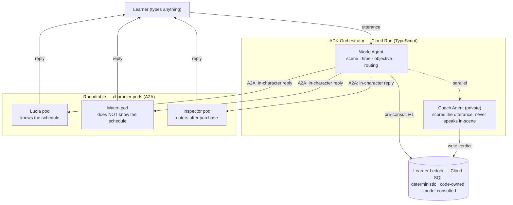

# Lingua Franca

**Learn a language by making yourself understood.**

An agentic conversation game. You enter a simulated world with an objective,
you can only type, and you pass by producing a sentence that *works* — not a
perfect one. Characters have their own knowledge, goals, and memory of you. A
private Coach agent evaluates whether your language actually accomplished the
goal, and a deterministic learner ledger — not the model — decides what you've
learned and what comes next.

> Built during the All Things Agentic Hackathon submission window on top of our
> existing open-source [Roundtable](https://github.com/foxtrotcommunications/foxtrotcommunications-roundtable-core)
> agent runtime (Apache-2.0). Category: **Collaborative Partner**.

---

## The distinction

| Traditional language app | Lingua Franca |
|---|---|
| Produce the *expected* sentence | Accomplish the *communicative* goal |
| Grammar correctness is pass/fail | Adequacy is tiered: understood / repaired / failed |
| Corrections interrupt | The world just *reacts* to what you said |

`Quiero Toledo mañana nueve.` is broken Spanish. Lucía still understands it and
sells you the ticket — then, after you succeed, shows you the natural version.
Communication comes before perfection.

## Architecture

Three agent roles, each owning genuinely different state, with a deterministic
ledger as the canonical source of truth.



**Why this shape.** World, characters, and Coach are all **Roundtable workspace
pods**, provisioned from blueprints in the Application Registry and given their
tools/capabilities by the `@lingua-franca/tools-world` plugin (same pattern as
`@pendragon/tools-plaid`). Each pod runs Gemini. The plugin enforces the Chinese
Wall at the store boundary — a character pod can only read its own memory rows.
Google ADK wraps the app-side turn orchestration. The ledger is the
*deterministic floor*: the model judges whether an utterance works, but code owns
the learner's state and every progression decision — a charitable model cannot
inflate you past what the ledger records. Difficulty (Krashen's *i+1*) is
**computed, never narrated**.

### Plugin & templates (built the Pendragon way)

- **`packages/tools-world/`** — the domain plugin. `registerFromEnv` picks a
  registrar by `domainType` (`world` / `character` / `coach`), registers that
  pod's tools + capabilities, and installs app hooks (learning provenance,
  in-scene activity labels, the mandatory ledger pre-consult on the World pod).
  Exposes `getCapabilities()` / `getAllowedOps()` per domain.
- **`api/application/`** — the Application Registry manifest + five blueprints
  (`world`, `lucia`, `mateo`, `inspector`, `coach`). `register.ts` upserts them
  to Roundtable so `template: 'lingua-franca-lucia'` resolves at provision time.
  Character identity + asymmetric knowledge live in each blueprint's metadata.
- **`api/services/domain-constants.ts`** — tools + bridge-contract
  `allowedActions` per domain, kept in lockstep with the plugin's `DOMAIN_CAPS`.

**Per-turn critical path:** pre-consult ledger (deterministic) → one character
inference over A2A → reply. The Coach evaluates in parallel and updates the
ledger asynchronously, so it never blocks the character's response.

### Requirement mapping (hackathon)

| Requirement | How |
|---|---|
| Gemini 3.5+ | Character pods + Coach/World agents |
| Google agent framework | **Google ADK** (TypeScript SDK) for the orchestrator + Coach |
| Google Cloud infra | Cloud Run (ADK service) + Cloud SQL (ledger) + GKE (Roundtable pods) |

## Status

Slice 1 in progress — Madrid train station, buy a ticket to Toledo.

- [x] Deterministic learner ledger (state, SRS, CEFR, i+1 pre-consult) — `packages/tools-world/src/ledger/`, 7 tests green
- [x] `@lingua-franca/tools-world` plugin — world/character/coach registrars, capabilities, app hooks, `registerFromEnv`
- [x] Application Registry: manifest + 5 blueprints + `register.ts` (Pendragon-style)
- [x] Domain constants — tools + contract allowed-actions per domain
- [x] Scene 1 definition with asymmetric character knowledge — `api/scenes/madrid-station.ts`
- [x] ADK app-side turn orchestrator — World `LlmAgent` + `FunctionTool`s + `InMemoryRunner` (`api/orchestrator/`); deterministic tools tested via a fake backed by the real ledger (4 tests).
- [x] **Live turn against Gemini 3.5 on Vertex** (`roundtable-public`, global endpoint) — `npm run demo`. Broken Spanish (`Quiero Toledo mañana nueve. Tarjeta.`) is understood and completes the objective: the communicative-adequacy thesis, proven end-to-end.
- [x] Production A2A `RoundtableClient` + control-plane client + provisioning script (`api/services/roundtable.ts`, `api/orchestrator/roundtableClient.a2a.ts`, `api/provisioning/provisionScene.ts`); env-selected via `clientFactory` (fake by default, pods when `LF_USE_PODS=true`). Artifact parser unit-tested (4 tests).
- [ ] **Live pod fleet** (billed infra): publish `@lingua-franca/tools-world` to Artifact Registry → build a roundtable-core image with `PLUGINS=@lingua-franca/tools-world` → create org + `ROUNDTABLE_API_KEY` → `npm run provision` (5 pods + contracts) → one live turn with `LF_USE_PODS=true`
- [x] **Scenario builder + play UI** (React 19 + Vite + Express) — verified in-browser end to end: describe a scene → live scenario generation → live scene/character art (`gemini-2.5-flash-image`) → cinematic play with multi-turn in-character dialogue, three-tier feedback (🟢/🟡/🔴), cumulative deterministic progress, and the completion reveal (natural-sentence upgrade + "you made yourself understood"). `npm run dev`.
- [ ] Optional: route UI turns through the real pods / ADK for a "show the architecture" beat; agent-topology viz
- [ ] Warm-up, demo dry-runs, ~4-min video, architecture diagram export, submission

## Project structure

```
lingua-franca/
├── api/
│   ├── application/          # Application Registry (Pendragon-style)
│   │   ├── manifest.ts       # the 5-blueprint manifest, plugin: @lingua-franca/tools-world
│   │   ├── register.ts       # PUT /api/applications/lingua-franca
│   │   ├── blueprints/       # world · lucia · mateo · inspector · coach
│   │   └── prompts/world.ts  # the World orchestrator system prompt
│   ├── orchestrator/         # ADK turn orchestrator (Google ADK)
│   │   ├── worldAgent.ts     # World LlmAgent + FunctionTools + InMemoryRunner
│   │   ├── tools.ts          # deterministic turn tools (pre-consult/ask/evaluate/advance)
│   │   ├── roundtableClient.ts # seam to the pods (+ fake backed by the real ledger)
│   │   └── vertex.ts         # Gemini-via-Vertex config
│   ├── services/
│   │   └── domain-constants.ts
│   └── scenes/               # scene content (madrid-station)
└── packages/
    └── tools-world/          # the domain plugin (@lingua-franca/tools-world)
        └── src/
            ├── index.ts      # registerFromEnv, DOMAIN_CAPS, getCapabilities
            ├── domains/      # world · character · coach registrars
            ├── ledger/       # the deterministic learner ledger + tests
            ├── provenance/   # learning provenance + activity labels (app hooks)
            └── prompt/       # shared system-prompt sections
```

## Develop

```bash
npm install
npm test          # ledger suite (via the plugin)
npm run typecheck # app + plugin, strict mode
```

Requires Node 20+. Stores run in-memory for tests; production swaps in Cloud SQL
implementations with identical semantics.
